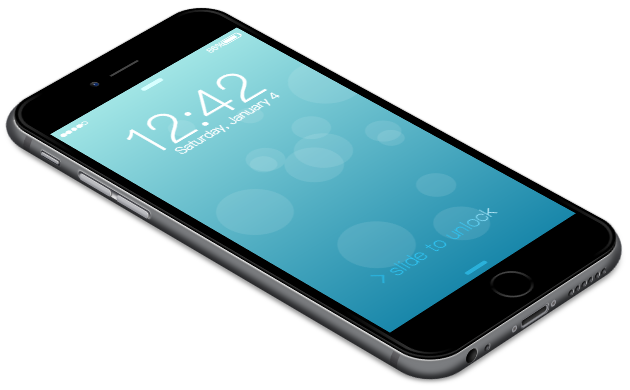
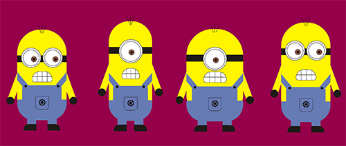
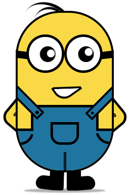

# Magical CSS
css3提供了很多新特性，使我们可以利用css实现各种有意思的图形甚至是很复杂的动画人物，比如机器猫、小黄人等模型，我总结了网络上比较火的一些用css3实现的经典案例（灵感来自于[重拾CSS乐趣](https://www.kancloud.cn/kancloud/cssmagic/63242)这篇文章），希望这些案例能够让你重拾CSS的乐趣，同时重新认识css这门语言，css的博大精深之处在于：你以为你都懂，其实你都不懂！

## 目录结构
为了有一个比较清晰的目录结构，我将每一个案例都单独用一个文件夹包裹，而将html和css分为两个文件，从而符合了『结构表现』分离的原则，同时也有助于大家对照着去看

***

### 机器猫（Doraemon_1）

#### 效果展示

#### [原文链接](https://www.acgxt.com/9.html)

***

### 机器猫（Doraemon_2）

#### 效果展示

#### [原文链接](http://developer.51cto.com/art/201504/473826.htm)

***

### iphone（iphone_1）

#### 效果展示

#### [原文链接](http://blog.csdn.net/qq_15096707/article/details/53579453)

***

### iphone（iphone_2）

#### 效果展示

#### [原文链接](http://blog.csdn.net/qq_15096707/article/details/53579453)

***

### 小黄人（Minions_1）

#### 效果展示

#### [原文链接](https://segmentfault.com/a/1190000005095807)

***

### 小黄人（Minions_2）

#### 效果展示

#### [原文链接](http://bbs.csdn.net/topics/390570738)

***

### 小黄人（Minions_3）

#### 效果展示

#### [原文链接](http://www.jianshu.com/p/79a0068e98c1)

***

### HelloKitty（HelloKitty_1）

#### 效果展示

#### [原文链接](http://lorenai.com/playground/hello-kitty.html)

***

### 其他纯CSS图形

其实CSS3能做的不仅仅只有上面这些，但由于篇幅关系，就选取了我认为最难实现的一些图形放在了这个项目中，下面是一些前端大牛用CSS3实现的图形，比如Opera logo、IE logo、HTML5 logo等等：

* [使用纯洁的CSS实现HTML5的新logo](http://www.zhangxinxu.com/wordpress/?p=1393)
* [拾人牙慧 – CSS3实现Opera浏览器的logo](http://www.zhangxinxu.com/wordpress/?p=1012)
* [令人难以置信的纯CSS3图标和Logo](http://www.17css.com/amazingly-realistic-css3-icons-and-logos/)