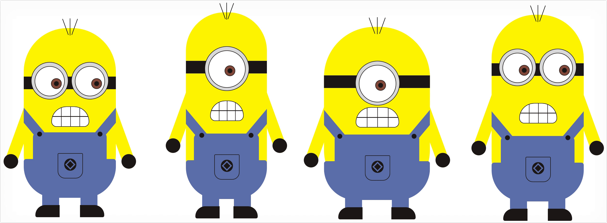

# Magical CSS
css3提供了很多新特性，使我们可以利用css实现各种有意思的图形甚至是很复杂的动画人物，比如机器猫、小黄人等模型，我总结了网络上比较火的一些用css3实现的经典案例（灵感来自于[重拾CSS乐趣](https://www.kancloud.cn/kancloud/cssmagic/63242)这篇文章），希望这些案例能够让你重拾CSS的乐趣，同时重新认识css这门语言，css的博大精深之处在于：你以为你都懂，其实你都不懂！

## 目录结构
为了有一个比较清晰的目录结构，我将每一个案例都单独用一个文件夹包裹，而将html和css分为两个文件，从而符合了『结构表现』分离的原则，同时也有助于大家对照着去看

目前本项目已经通过Github Pages搭建完毕，可以[点击这里](https://merrier.github.io/Magical-CSS/)查看

### 机器猫（Doraemon_1）
这款机器猫是目前为止我看到过的实现的最好的，还原度很高，而且作者对于阴影的把控恰到好处，使机器猫变得生动立体，可以看出来，作者不仅仅是一名前端大牛，更是一个追求完美，注重细节的设计师。
#### 效果展示

#### [原文链接](https://www.acgxt.com/9.html)
#### [在线展示](https://merrier.github.io/Magical-CSS/Doraemon_1/Doraemon_1.html)

***

### 机器猫（Doraemon_2）

这款机器猫虽然没有上一款那么精致，但是也已经充分彰显了CSS的无穷魅力，如果你觉得上一款机器猫对于你来说难度太大，不如先拿这款机器猫练手。

#### 效果展示

#### [原文链接](http://developer.51cto.com/art/201504/473826.htm)
#### [在线展示](https://merrier.github.io/Magical-CSS/Doraemon_2/Doraemon_2.html)

***

### iphone（iphone_1）

这款iphone是所有本项目中介绍的图形中最简单的一个，但是也用到了CSS的很多技巧，很适合作为入门教材。

#### 效果展示

#### [原文链接](http://blog.csdn.net/qq_15096707/article/details/53579453)
#### [在线展示](https://merrier.github.io/Magical-CSS/iphone_1/iphone_1.html)

***

### iphone（iphone_2）

这款iphone从图片上看不出它的博大精深之处，因为作者连锁屏的动画都实现了！是目前为止我见过的实现的最精致、最完美的iphone；然而只可远观不可亵玩，其代码量多的惊人，对于我这种CSS渣渣来说，只能欣赏了。

#### 效果展示

#### [原文链接](http://blog.csdn.net/qq_15096707/article/details/53579453)
#### [在线展示](https://merrier.github.io/Magical-CSS/iphone_2/iphone_2.html)

***

### iwatch（iwatch_1）

用CSS3实现的iwatch加载动画，阴影配色都很逼真！

#### 效果展示

#### [原文链接](https://www.w3cplus.com/css3/watch.html)
#### [在线展示](https://merrier.github.io/Magical-CSS/iwatch_1/iwatch_1.html)

***

### 小黄人（Minions_1）

这四个小黄人其实用的是一套样式，只不过作者利用的less的函数功能，给小黄人添加不同的类名就可以达到不同的效果，高低胖瘦都可以变化，但是长相实在不敢苟同。

#### 效果展示

#### [原文链接](https://segmentfault.com/a/1190000005095807)
#### [在线展示](https://merrier.github.io/Magical-CSS/Minions_1/Minions_1.html)

***

### 小黄人（Minions_2）

这款小黄人虽然表面看上去比较怪异，但是最起码长相比上面四个强了不少，配色也比较和谐温和。

#### 效果展示

#### [原文链接](http://bbs.csdn.net/topics/390570738)
#### [在线展示](https://merrier.github.io/Magical-CSS/Minions_2/Minions_2.html)

***

### 小黄人（Minions_3）

这款小黄人还原度低了些，但是作者利用CSS3的animation和transform让其动了起来，还是很活灵活现的，同时原文链接中作者对于实现的过程也作了详细的解释，可谓贴心。

#### 效果展示

#### [原文链接](http://www.jianshu.com/p/79a0068e98c1)
#### [在线展示](https://merrier.github.io/Magical-CSS/Minions_3/Minions_3.html)

***

### HelloKitty（HelloKitty_1）

这是我最喜欢的一个图形了，还原度非常高，同时作者对于细节的刻画也很到位，美中不足的是没有添加相应的动画进去，如果她能够动起来，那就完美了！

#### 效果展示

#### [原文链接](http://lorenai.com/playground/hello-kitty.html)
#### [在线展示](https://merrier.github.io/Magical-CSS/HelloKitty_1/HelloKitty_1.html)

### douyin

前端大神[chokcoco](https://github.com/chokcoco)的大作，单标签实现抖音logo！

#### 效果展示

#### [原文链接](https://github.com/chokcoco/CSS-Inspiration#%E9%98%B4%E5%BD%B1box-shadowdrop-shadow)
#### [在线展示](https://merrier.github.io/Magical-CSS/douyin/douyin.html)

***

### 其他纯CSS图形

其实CSS3能做的不仅仅只有上面这些，但由于篇幅关系，就选取了我认为最难实现的一些图形放在了这个项目中，下面是一些前端大牛用CSS3实现的图形，比如Opera logo、IE logo、HTML5 logo等等：

* [ChokCoco用单标签实现各种图形](http://sbco.cc/magicCss/html/index.html)
* [使用纯洁的CSS实现HTML5的新logo](http://www.zhangxinxu.com/wordpress/?p=1393)
* [拾人牙慧 – CSS3实现Opera浏览器的logo](http://www.zhangxinxu.com/wordpress/?p=1012)
* [令人难以置信的纯CSS3图标和Logo](http://www.17css.com/amazingly-realistic-css3-icons-and-logos/)
* [CSS3 SVG实现可爱的动物哈士奇和狐狸动画](http://www.codeceo.com/article/css3-svg-husky-and-fox.html)
* [CSS3 实现的蜜蜂](http://www.html5tricks.com/demo/css3-bee/index.html)
* [苹果全家桶：iphone、ipad、imac、iwatch](http://www.html5tricks.com/demo/css3-iphone-ipad-imac-iwatch/index.html)
* [可爱猫脸](http://www.html5tricks.com/demo/css3-pretty-cat-face/index.html)
* [行走的大象](http://www.html5tricks.com/demo/pure-css3-elephant-animation/index.html)
* [人物行走动画](http://www.html5tricks.com/demo/css3-walking/index.html)
